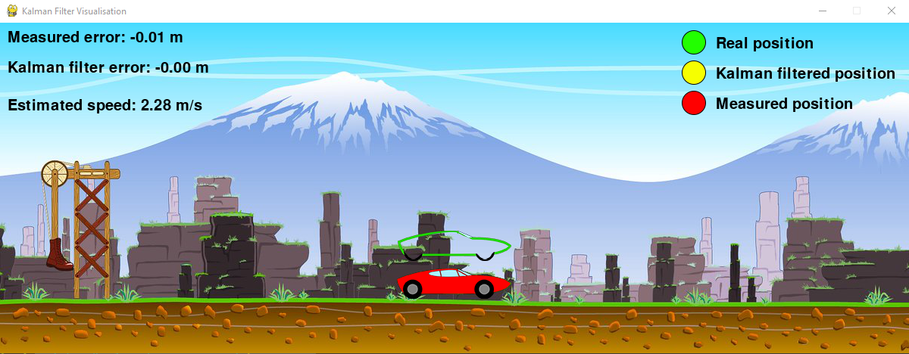

[![Contributors][contributors-shield]][contributors-url]
[![Forks][forks-shield]][forks-url]
[![Stargazers][stars-shield]][stars-url]
[![Issues][issues-shield]][issues-url]
[![MIT License][license-shield]][license-url]
[![LinkedIn][linkedin-shield]][linkedin-url]


<!-- PROJECT LOGO -->
<br />
<p align="center">
  <a href="https://github.com/simonusher/kalman-filter">
    
  </a>
  <h3 align="center">Kalman filter simulation and visualization</h3>
  <p align="center">
    Kalman filter simulation and visualization with variable timestep.
  </p>
</p>

## Built With
* python,
* [Pygame](https://www.pygame.org/),
* [numpy](https://numpy.org/).


<!-- GETTING STARTED -->
## Getting Started

### Prerequisites
* python, tested on 3.8.2.
If you have pyenv, you can install this version using:
  ```sh
  pyenv install 3.8.2
  ```

### Installation

1. Clone the repo
   ```sh
   git clone https://github.com/nikitaminchenko01/kalman-filter.git
   ```
2. Create a virtual environment and activate it (optional):
   ```sh
   python -m venv env
   env/bin/activate
   ```
3. Install the requirements:
   ```sh
   pip install -r requirements
   ```


<!-- USAGE EXAMPLES -->
## Usage

You can run the script using:
  ```sh
  python main.py
  ```


<!-- LICENSE -->
## License

Distributed under the MIT License. See `LICENSE` for more information.


<!-- CONTACT -->
## Contact
Original author: Szymon Woźniak - swozniak6@gmail.com
Me: Nikita Minchenko - nikitaminchenko01@gmail.com


[contributors-shield]: https://img.shields.io/github/contributors/simonusher/kalman-filter.svg?style=for-the-badge
[contributors-url]: https://github.com/simonusher/kalman-filter/graphs/contributors
[forks-shield]: https://img.shields.io/github/forks/simonusher/kalman-filter.svg?style=for-the-badge
[forks-url]: https://github.com/simonusher/kalman-filter/network/members
[stars-shield]: https://img.shields.io/github/stars/simonusher/kalman-filter.svg?style=for-the-badge
[stars-url]: https://github.com/simonusher/kalman-filter/stargazers
[issues-shield]: https://img.shields.io/github/issues/simonusher/kalman-filter.svg?style=for-the-badge
[issues-url]: https://github.com/simonusher/kalman-filter/issues
[license-shield]: https://img.shields.io/github/license/simonusher/kalman-filter.svg?style=for-the-badge
[license-url]: https://github.com/simonusher/kalman-filter/blob/master/LICENSE.txt
[linkedin-shield]: https://img.shields.io/badge/-LinkedIn-black.svg?style=for-the-badge&logo=linkedin&colorB=555
[linkedin-url]: https://www.linkedin.com/in/szymon-wo%C5%BAniak-00505318a/